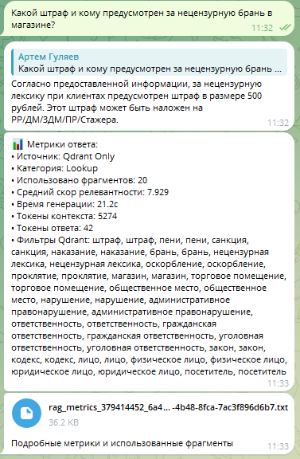
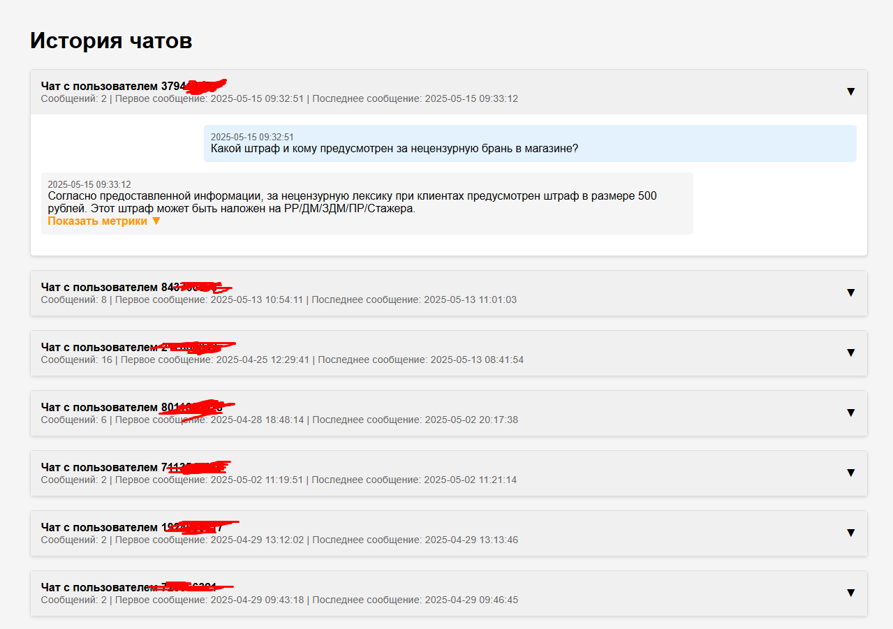
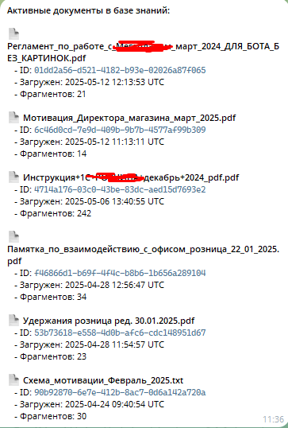

# RAG-бот для "_______"

## Описание проекта

RAG-бот - это MVP-решение для внутреннего использования в компании "__________", предназначенное для обучения и консультирования сотрудников розничных точек. Система построена на технологии Retrieval-Augmented Generation (RAG), которая позволяет генерировать точные ответы на основе внутренней базы знаний компании.

### Ключевые особенности

- 🤖 Telegram-бот как основной интерфейс взаимодействия
- 📚 Поддержка различных форматов документов (TXT, PDF, DOCX)
- 🔍 Семантический поиск с использованием векторной базы данных
- 📊 Детальные метрики для анализа качества ответов
- 🔄 Поддержка контекста диалога
- 👥 Разделение прав доступа (пользователи/администраторы)
- 📈 Масштабируемая архитектура для будущего роста

### Технический стек

- **Бэкенд**: FastAPI, MongoDB, Qdrant
- **Фронтенд**: Telegram Bot (aiogram 3.x)
- **LLM**: 
  - Локальная Gemma-3-12b (OpenAI-совместимый API)
  - Google Gemini API (опционально)
- **Embeddings**: SentenceTransformers (sbert_large_nlu_ru)

## Тестирование и выбор технологий

В процессе разработки MVP был проведен тщательный анализ и тестирование различных технологий:

### Векторные базы данных
- **Qdrant** (выбран): Лучшая производительность для русского языка, удобный API

### Языковые модели
- **Gemma-3-12b** (выбрана): Оптимальное соотношение цена/качество
- **Llama-2**: Высокие требования к ресурсам
- **Mistral**: Проблемы с русским языком
- **GPT-3.5/4**: Высокая стоимость, зависимость от API
- **Gemini**: Хорошая альтернатива, используется как запасной вариант
- **В том числе** Тинькофф модели, яндексгпт и другие - причина отказа: не влезают на ресурсы сервера

### Embeddings модели
- **sbert_large_nlu_ru** (выбрана): Лучшие результаты для русского языка
- **Multilingual SBERT (paraphrase-multilingual-MiniLM/L6-v2, distiluse-base-multilingual-cased-v1, paraphrase-multilingual-mpnet-base-v2 и др., всех размеров)**: Показали плохие результаты для русского языка, не рекомендованы для задач на русском

## Структура проекта


```
.
├── back/           # Бэкенд-сервис (FastAPI)
├── front/          # Telegram-бот
└── README.md       # Этот файл
```

## Документация

- [Документация бэкенда](back/README.md) - Описание API, настройка бэкенд-сервиса
- [Документация бота](front/README.md) - Руководство по настройке и использованию Telegram-бота
- [Инструкция по использованию](instructions.md) - Подробное руководство для пользователей и администраторов

## Демонстрация

### Пример ответа с метрикой (rag2)



### Пример истории переписок с метриками (rag3)



### Пример списка загруженных документов (rag4)




